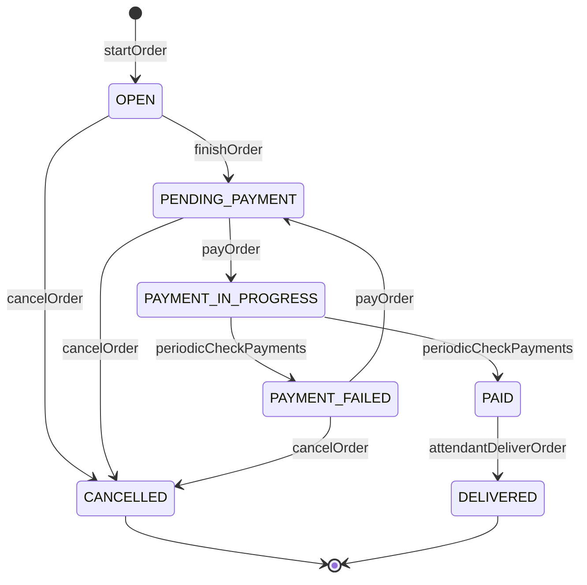

# Order


## Assessment Instructions
see `java-backend-test-docx.pdf`

## Breakdown and scope
Domain organization, inspired by spring Modulith, all related components are in the same package:
* product
    * Category
    * Product
* user
    * User
* order
    * Order
    * ProductInOrder
    * OrderEvent
* order.pay


The API is pragmatic, it doesn't follow many of the REST principles, for example it lacks links, all the entities are first level so it will be simple to parse URLs and get IDs to fill the request dtos.

All request Dtos uses jakarta validation.

JPA model doesn't use any bidirectional relation (no OneToMany) in order to control where/how the entities are fetched.
 
ManyToOne relations required to create Dtos are fetch eagerly using EntityGraphs on the repository, avoiding 1 + N problems.


### User
We will consider tow kinds of users: Passengers and Attendants.

Each will have its specific endpoints with authorization based on this role.

The API covers the passenger registration, but the attendants are pre-initialized.

Out of scope:
* adding Locale to the user
* proper validation of email (but it'll require inet)
* once the Order is paid, send an email with the recipe


### Product
Considering its possible to have a very rich hierarchy of Categories -- so expect a lot of levels of parent categories.
Assuming a single ROOT category (only one category without parent) will simplify some recursive queries. 
* But its tricky to enforce it on database
* Products cannot be assigned to the ROOT category

Its possible to list categories/products form a parent category (optionaly).

The API doesn't return products without stock.
    
Out of scope:
* Product and Category translation (based of the locale of the user)
* Product imageUrl will be implemented by uploading the image to the server and serving as static content (not in DB)
* Could consider not showing Categories without Products (or without stock)


### Order
We will track all the changes of an order using an event entity.

The order will not pre-compute a total price, its an SQL formula based on the products price.

A single user can open as many orders as they want, and in different seats.

The inventory check is simply implemented with a @Version on the product itself, preventing concurrent modifications.

We are considering the payment gateway can take time to confirm a transaction, so there is a periodic process to update the payment state.

Out of scope:
* Product now contains price and available stock, it will be a good idea to split this in at least an additional table, so we can manage the product catalog, and the specifics of a trip (eg, price / currency + available in inventory)
    * Currency is not properly enforced, we are assuming all the products will use the same Currency. It could be an attribute of a Trip entity, property of the User or even in the application configuration.
* Refund
* Improve the transactionality of payment, we could use TransactionTemplate or implement the store methods on the payment gateway.    
* Add some limit on the number of pending orders of a user
* Add some limit on the number of products in an order


#### Order status
The status will include the payment status, this should unify the workflow.



## Application

### Requirements

*  `docker` in order to start a `postgresql` container. Its managed by the app itself, if its already provided simply uncomment `spring.docker.compose.lifecycle-management=none` from `application.properties`.

* `mvn` to build the project

* `jdk21` runtime


### Development

start application

```
mvn spring-boot:run
```

### Tests

run tests

```
mvn verify
```


maven is enforcing the test coverage.

Missing Repository tests.

Tests rely on EntitySetup, it will be nice to have a more detailed setups on each test.


### OpenAPI
To include javadoc on the documentation run with specific profile:

```
mvn spring-boot:run -Popenapi-with-javadoc
```

Then the doc is accessible at:

http://localhost:8080/swagger-ui/index.html

requires login, can use a default attendant:
* user: att1 
* password: Att1Passowrd!
